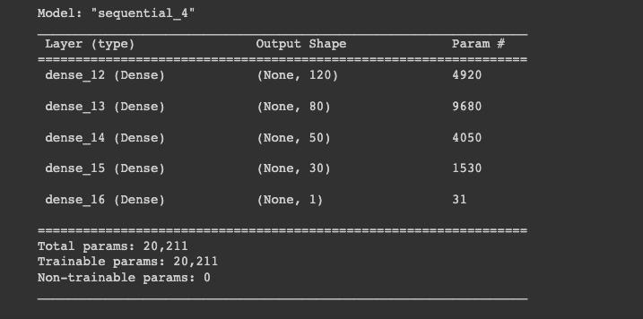

# Neural_Network_Charity_Analysis

# Purpose of the project:
The purpose of the project is to use a neural network machine learning model to help the foundation, Alphabet Soup, to predict where the foundation should invest with its funding, based on the data provided by the foundation's business team. The data has the foundation's funding record from over the years, containing more than 34,000 organizations that received funding from Alphabet Soup. And it included the metadata of each column:  
- EIN and NAME—Identification columns
- APPLICATION_TYPE—Alphabet Soup application type
- AFFILIATION—Affiliated sector of industry
- CLASSIFICATION—Government organization classification
- USE_CASE—Use case for funding
- ORGANIZATION—Organization type
- STATUS—Active status
- INCOME_AMT—Income classification
- SPECIAL_CONSIDERATIONS—Special consideration for application
- ASK_AMT—Funding amount requested
- IS_SUCCESSFUL—Was the money used effectively

# Results
- **What variable(s) are considered the target(s) for your model?**  
The goal of the project is to help the foundation better use it's funding, with the metadata provided along with the data, I considered the "IS_SUCCESSFUL" column as the target for the model since it contains the data of if the funding by the Alphabet Soup was used effectively.

- **What variable(s) are considered to be the features for your model?**  
I considered "APPLICATION_TYPE", "AFFILIATION", "CLASSIFICATION", "USE_CASE", "ORGANIZATION", "STATUS", "INCOME_AMT", "SPECIAL_CONSIDERATIONS", "ASK_AMT" as the features for the model.

When I tried to improve the accuracy of the model, I also removed the "STATUS" columns, the reason being the data was from over the years of funding records, and over the year some organizations could be closed, merged, renamed, or other possible reasons for the company in the list no longer active. The purpose is to help the foundation predict where its funding should go and could be used effectively, could some cases the organization was used the funding effectively but no longer active, so I decided to remove this column to reduce noise for the model. And I also removed the "SPECIAL_CONSIDERATION" column for the same reason.

- **What variable(s) are neither targets nor features, and should be removed from the input data?**  
The "EIN" and "NAME" columns should be removed since they only provided the identification of the organizations that received the funding, which isn't helpful for our model to determine and predict if the funding was used or would be used effectively, so I the two columns removed from the input data.

- **How many neurons, layers, and activation functions did you select for your neural network model, and why?**  
  
  
First, I set 2 hidden layers and one output layer, with 80 neurons for the first layer, and 30 neurons for the second layer, both layers used relu activation, and the output layer has one neuron with sigmoid activation. The input data has 44 features, so I set the neurons for the first layers roughly 2 times the number of the input layers, and set epoch to 50. the accuracy for this model is about 72%.

  
  
Starting from the second attempt, I also drop the "STATUS" and "SPECIAL_CONSIDERATION" columns.
In the second attempt, I increased the neurons for the first layer to 120, which is three times the input features, activation set as relu. The second layer has 50 neurons, activation set as leaky_relu, and the output layer is the same as the first one. Epoch for this model is set to 80. The accuracy for this model is close to 73%.

  
. 
In the third attempt, I  keep the neuron numbers for the first two layers, changed the activation function on the second layer to relu, and add a third layer which has 30 neurons and activation function set as tanh, output layer stay the same. Epoch is set to 100, and the accuracy for this model is 72%.

. 
  
In the fourth attempt, I have the first layer with 120 neurons, activation as relu. Second layer with 80 neurons, activation as sigmoid. Third layer with 50 neurons, activation as sigmoid. And add the fourth layer with 30 neurons, activation as sigmoid. The output layer stays the same. Epoch for this model is set to 100. The accuracy for this model is 72%.

With different models adding layers and changing neuron numbers and activation as a trail and error process to see if changing those parameters will help with the performance of the models.

- **Were you able to achieve the target model performance?**  
I wasn't able to achieve with the performance of 75% with the models above.

- **What steps did you take to try and increase model performance?**  
After the initial model, I tried to remove the "STATUS" and "SPECIAL_CONSIDERATION" columns. Adding neurons, and layers and changing the activation function for the models to try to increase model performance.

# Summary
The overall accuracy for the models I used is around 72%, the performance of the models didn't have much improvement with adding neurons, and layers. Different activation functions will also have a different impact, so one method could be to keep trying to find the optimal activation function for the dataset, adding more neurons and layers to have a more complex model to see if it could help with improving the model's performance.

The other direction we can take is to work on the input data, find out further information about the columns to determine if we should drop it, binned the variables, or other methods if needed

Since I've tried adding more neurons and layers but still not seeing any significant performance improvement, turning out to focus on the input features might have a good direction regarding improving the models' performance.
